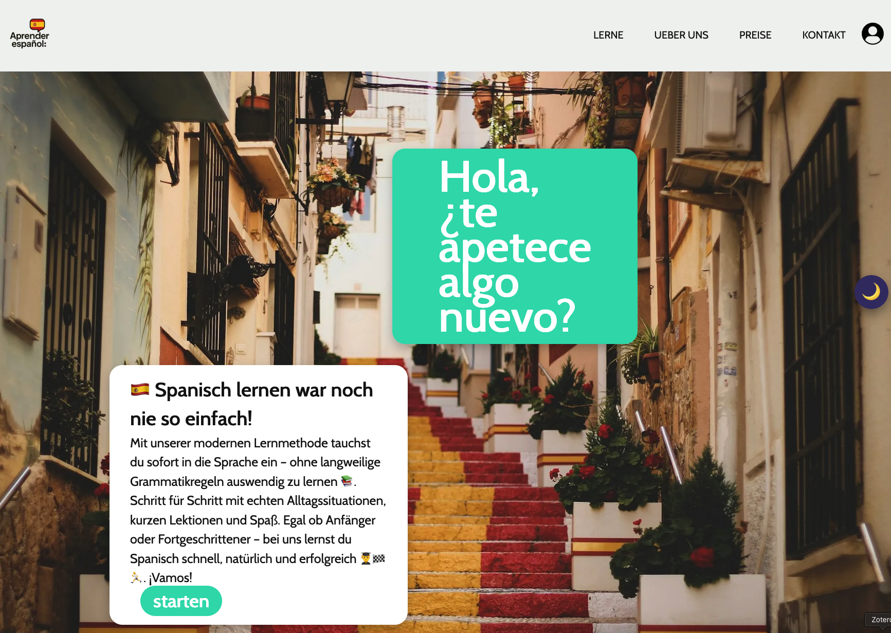
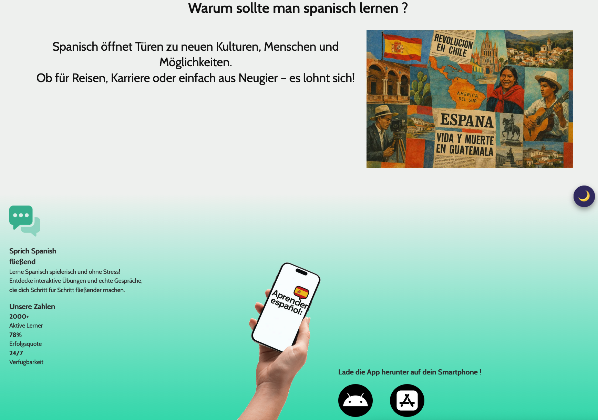
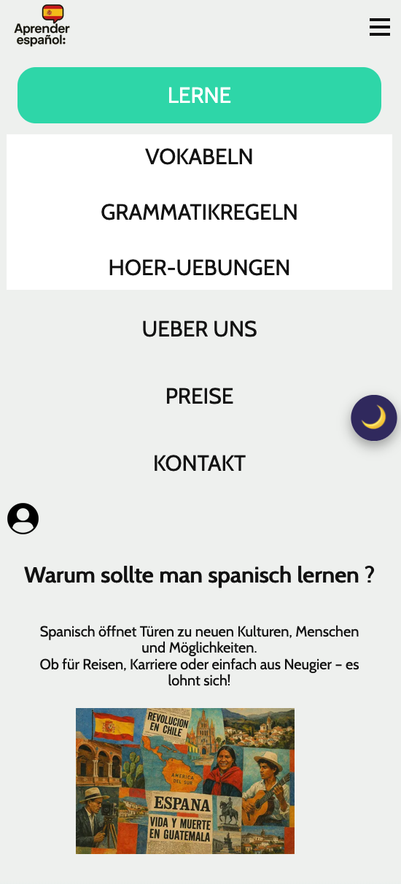

# 🌍 Aprende Espanol - Moderne Spanisch-Lernplattform

Eine vollständig responsive, moderne Webanwendung zum Spanischlernen mit interaktiven Features, dynamischen Inhalten und Dark Mode. Dieses Projekt wurde im Rahmen des **WEB-Moduls** meines Studiums entwickelt und demonstriert die Umsetzung moderner Frontend-Technologien.

 

 
 

## ✨ Features

### 🎯 Kernfunktionen
- ✅ **Responsive Design** - Mobile-First Ansatz mit Media Queries
- ✅ **Automatisches Bildkarussell** - Fade-Übergänge alle 20 Sekunden
- ✅ **Dynamische Inhalte** - JSON/XML-Fetch für Kundenbewertungen und Kurse
- ✅ **Dark Mode** - Toggle mit localStorage-Persistenz
- ✅ **Accessibility** - ARIA-Labels, semantisches HTML, Keyboard-Navigation
- ✅ **Performance Optimized** - Lazy Loading, WebP-Bilder, CSS Variables

### 📱 Responsive Breakpoints
- **Mobile**: < 768px (Hamburger-Menü, vertikale Layouts)
- **Tablet**: 768px - 1024px (adaptives Layout)
- **Desktop**: > 1024px (volle Navigation, horizontale Layouts)

### 🛠️ Technische Highlights
- **Modern CSS**: Flexbox, Grid, CSS Variables, Aspect Ratio
- **Vanilla JavaScript**: ES6+, Fetch API, IntersectionObserver, DOM Manipulation
- **Optimierte Assets**: WebP-Bilder mit srcset, Lazy Loading, Font-Swap
- **Cross-Browser**: Kompatibel mit Chrome, Firefox, Safari

### Features nutzen

  *   Dark Mode: Klick auf den 🌙 Button oben rechts

  *   Bildkarussell: Automatischer Wechsel alle 20 Sekunden

  *   Dynamische Inhalte: Bewertungen werden aus JSON geladen

  *   Kursübersicht: XML-basierte Kursliste nach dem Feedback-Bereich
  *   Druckansciht Str + P
